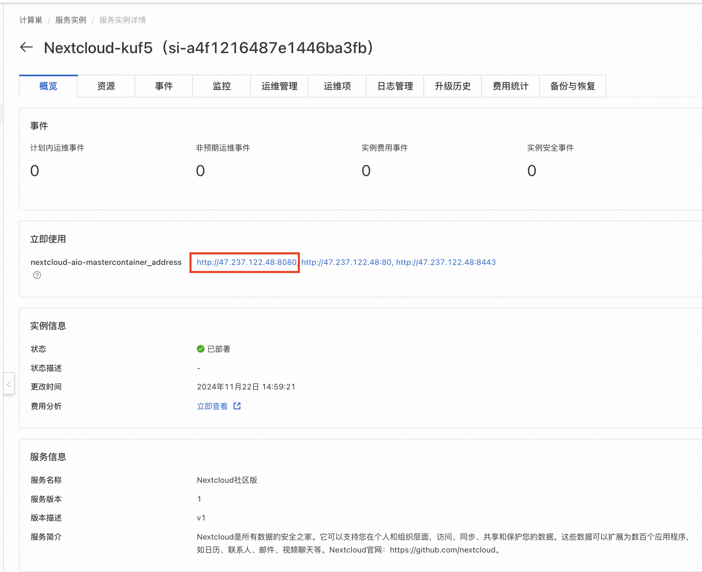

# Nextcloud计算巢快速部署

>**免责声明：**本服务由第三方提供，我们尽力确保其安全性、准确性和可靠性，但无法保证其完全免于故障、中断、错误或攻击。因此，本公司在此声明：对于本服务的内容、准确性、完整性、可靠性、适用性以及及时性不作任何陈述、保证或承诺，不对您使用本服务所产生的任何直接或间接的损失或损害承担任何责任；对于您通过本服务访问的第三方网站、应用程序、产品和服务，不对其内容、准确性、完整性、可靠性、适用性以及及时性承担任何责任，您应自行承担使用后果产生的风险和责任；对于因您使用本服务而产生的任何损失、损害，包括但不限于直接损失、间接损失、利润损失、商誉损失、数据损失或其他经济损失，不承担任何责任，即使本公司事先已被告知可能存在此类损失或损害的可能性；我们保留不时修改本声明的权利，因此请您在使用本服务前定期检查本声明。如果您对本声明或本服务存在任何问题或疑问，请联系我们。

## 概述

Nextcloud Hub 是一款来自德国的完全开源的云上托管内容协作平台。团队内成员可以通过移动、桌面和 Web 界面访问、共享和编辑文档，聊天和参与视频通话以及管理邮件、日历和项目。目前，Nextcloud的产品定位是在保障数据安全下的完整协作平台，功能类似国内的企业钉钉或飞书，而Nextcloud的优势在于其从2016年创立起便致力于构建一个以保障数据安全合规为首要条件的托管云上协作平台，能够提供更成熟的数据安全的云上托管应用解决方案，大幅降低企业用户的部署与运维成本。Nextcloud官网：https://nextcloud.com/ 。

在2021年，Nextcloud 在线服务器已超过 400,000 台，截止2023年底，Nextcloud 的团队成员达到 100 人，其团队成员遍布 20 多个国家/地区，他们既可以远程办公，也可以在柏林和斯图加特的办公室办公。

阿里云计算巢已将一体式的Nextcloud打包为可一键部署的服务，您无需下载代码或安装复杂依赖，也无需连接国外VPN，仅需填写几个参数并等待2分钟，即可访问您的Nextcloud应用。

## 前提条件

部署Nextcloud社区版服务实例，需要对部分阿里云资源进行访问和创建操作。因此您的账号需要包含如下资源的权限。
  **说明**：当您的账号是RAM账号时，才需要添加此权限。

| 权限策略名称                          | 备注                     |
|---------------------------------|------------------------|
| AliyunECSFullAccess             | 管理云服务器服务（ECS）的权限       |
| AliyunVPCFullAccess             | 管理专有网络（VPC）的权限         |
| AliyunROSFullAccess             | 管理资源编排服务（ROS）的权限       |
| AliyunComputeNestUserFullAccess | 管理计算巢服务（ComputeNest）的用户侧权限 |

## 计费说明

Nextcloud社区版在计算巢部署的费用主要涉及：

- 所选vCPU与内存规格
- 系统盘类型及容量
- 公网带宽

## 部署架构

    

## 参数说明
| 参数组         | 参数项    | 说明                                                                     |
|-------------|--------|------------------------------------------------------------------------|
| 服务实例        | 服务实例名称 | 长度不超过64个字符，必须以英文字母开头，可包含数字、英文字母、短划线（-）和下划线（_） |
|             | 地域     | 服务实例部署的地域                                                              |
|             | 付费类型   | 资源的计费类型：按量付费和包年包月                                                      |
| ECS实例配置  | 实例类型   | 可用区下可以使用的实例规格                                                          |
|              | 实例密码   | 长度8-30，必须包含三项（大写字母、小写字母、数字、 ()`~!@#$%^&*-+=&#124;{}[]:;'<>,.?/ 中的特殊符号） |
| 网络配置        | 可用区    | ECS实例所在可用区                                                             |
|             | VPC ID | 资源所在VPC                                                                |
|             | 交换机ID  | 资源所在交换机                                                                |

## 部署流程
1. 访问计算巢Nextcloud社区版[部署链接](https://computenest.console.aliyun.com/service/instance/create/cn-hangzhou?type=user&ServiceName=Nextcloud社区版)
   ，按提示填写部署参数。其中，地域选择新加坡（国内地域无法访问），付费类型选择按量付费，可用区配置选择任意可用区ID与新建专有网络，其他部分保持默认值即可。
   
   

2. 参数填写完成，确认参数后点击**下一步：确认订单**。
   

3. 确认订单完成后同意服务协议，可以看到询价明细，点击**立即创建**
   进入部署阶段。
   
4. 提交成功后，点击**去列表查看**。等待部署完成，预计5分钟左右。
   
   

5. 等待部署完成后就可以开始使用服务，进入服务实例详情，将红框所在行的整个URL复制到浏览器中，然后只保留红框内的部分，并将http改为https，即可访问Nextcloud应用。
   

6. 访问成功后将进入下图页面，复制红框内文字，点击 Open Nextcloud AIO login 按钮。
   

7. 将上一步复制的文字粘贴到红框内，点击登录。即可开始配置和使用Nextcloud。配置和使用过程中如果遇到问题，请参考[Nextcloud官方使用文档](https://github.com/nextcloud/all-in-one/blob/main/readme.md)。
   